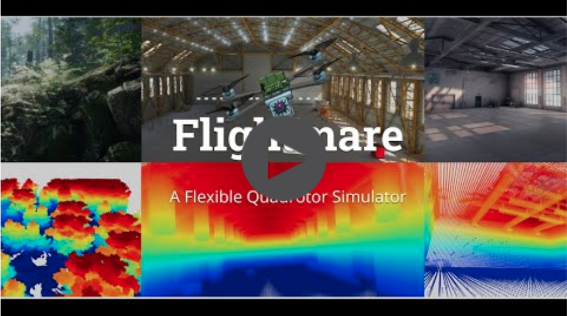

# Flightmare - Modern Reinforcement Learning Edition


**Flightmare** is a flexible modular quadrotor simulator. Flightmare is composed of two main components: a configurable rendering engine built on Unity and a flexible physics engine for dynamics simulation. Those two components are totally decoupled and can run independently from each other. Flightmare comes with several desirable features: (i) a large multi-modal sensor suite, including an interface to extract the 3D point-cloud of the scene; (ii) an API for reinforcement learning which can simulate hundreds of quadrotors in parallel; and (iii) an integration with a virtual-reality headset for interaction with the simulated environment. Flightmare can be used for various applications, including path-planning, reinforcement learning, visual-inertial odometry, deep learning, human-robot interaction, etc.

> **Note**: This is a maintained fork of the original Flightmare project (which is no longer actively maintained). This version includes significant improvements to the reinforcement learning stack and build system.

**[Original Website](https://uzh-rpg.github.io/flightmare/)** | 
**[Original Documentation](https://flightmare.readthedocs.io/)**

[](https://youtu.be/m9Mx1BCNGFU)

## What's New in This Edition

This maintained edition includes significant updates and improvements to the original Flightmare project:

### Modern Reinforcement Learning Stack

The legacy reinforcement learning implementation (`flightrl`) has been completely modernized in `flightrl_modern`:

- **Replaced TensorFlow 1.x** with **PyTorch 2.0+** for better performance and active maintenance
- **Upgraded from stable-baselines 2.x** to **Stable-Baselines3 2.0+** with improved APIs and optimizations
- **Migrated from gym 0.11** to **Gymnasium 0.28+** (official successor to OpenAI Gym)
- **Implemented SAC (Soft Actor-Critic)** as the default algorithm with full support for continuous control tasks
- **Added comprehensive evaluation utilities** for policy testing and analysis
- **Improved vectorized environment support** for faster training with multiple parallel environments

### Build System Improvements

All build issues have been resolved with a complete Docker-based build system:

- **Drag-and-drop Docker setup** in the `docker/` directory - build and run with minimal configuration
- **Multi-stage Docker builds** for optimized image sizes
- **Flexible build options**: CPU/GPU support, optional ROS/RL components
- **Automated verification scripts** to ensure correct installation
- **Comprehensive build documentation** and troubleshooting guides

See the [Docker Documentation](./docker/README.md) for detailed build instructions.

### Key Features

- **Production-ready RL stack**: Fully tested and verified implementation
- **Gymnasium-compatible interface**: Works seamlessly with modern RL libraries
- **GPU/CPU support**: CUDA acceleration for faster training
- **Vectorized environments**: Multi-environment support for parallel training
- **Comprehensive documentation**: Complete learning guides and API documentation
- **Backwards compatibility**: Migration guide for existing users

## Installation

### Docker Installation (Recommended)

The easiest way to get started is using Docker:

```powershell
# Build the container
cd docker
.\build_container.ps1

# Run the container
docker run -it --rm -p 10253:10253 flightmare:latest
```

See the [Docker Documentation](./docker/README.md) for detailed instructions, build options, and verification procedures.

### Manual Installation

For manual installation, refer to the original [Flightmare Wiki](https://github.com/uzh-rpg/flightmare/wiki) and the [flightrl_modern README](./flightrl_modern/README.md).

## Quick Start with Modern RL

### Training a SAC Agent

```python
from flightrl_modern.algorithms import train_sac

# Train SAC agent on Flightmare environment
model = train_sac(
    total_timesteps=1000000,
    n_envs=4,
    seed=42,
)

# Model automatically saved to ./models/sac/
```

### Command Line Training

```bash
cd flightrl_modern/examples
python train_sac.py --timesteps 1000000 --n_envs 4 --seed 42
```

### Evaluation

```bash
python evaluate_sac.py --model ./models/sac/best_model.zip --episodes 10 --render
```

See the [flightrl_modern README](./flightrl_modern/README.md) for complete documentation and examples.

## Project Structure

```
flightmare/
├── flightlib/              # C++ physics engine (core simulation)
├── flightrl_modern/        # Modern Python RL framework (NEW)
│   ├── envs/              # Gymnasium-compatible environment wrappers
│   ├── algorithms/        # Training algorithms (SAC, etc.)
│   └── examples/          # Example scripts and training code
├── flightrl/              # Legacy RL implementation (deprecated)
├── docker/                # Docker build system (NEW)
│   ├── Dockerfile         # Multi-stage build definition
│   ├── build_container.ps1 # Build script
│   └── README.md          # Docker documentation
└── docs/                  # Original documentation
```

## Migration from Legacy Code

If you're migrating from the old `flightrl` implementation:

1. **Environment**: Use `flightrl_modern.envs.make_flight_env()` instead of legacy wrappers
2. **Training**: Use `flightrl_modern.algorithms.train_sac()` or Stable-Baselines3 directly
3. **Evaluation**: Use `flightrl_modern.algorithms.evaluate_policy()` for consistent evaluation

See the [flightrl_modern README](./flightrl_modern/README.md) for detailed migration notes.

## Documentation

- **Main Documentation**: [Flightmare Documentation](https://flightmare.readthedocs.io/)
- **Modern RL Package**: [flightrl_modern/README.md](./flightrl_modern/README.md)
- **Docker Build System**: [docker/README.md](./docker/README.md)
- **Examples**: [flightrl_modern/examples/README.md](./flightrl_modern/examples/README.md)

## Updates

- **2025-10-21**: Complete modernization of RL stack with PyTorch + Stable-Baselines3 + Gymnasium
- **2025-11-07**: Docker-based build system with drag-and-drop setup
- **2025-11-07**: All build issues resolved and verified
- **2020-11-17**: [Spotlight](https://youtu.be/8JyrjPLt8wo) Talk at CoRL 2020
- **2020-09-04**: Original Flightmare release

## Publication

If you use this code in a publication, please cite the following paper **[PDF](http://rpg.ifi.uzh.ch/docs/CoRL20_Yunlong.pdf)**

```
@inproceedings{song2020flightmare,
    title={Flightmare: A Flexible Quadrotor Simulator},
    author={Song, Yunlong and Naji, Selim and Kaufmann, Elia and Loquercio, Antonio and Scaramuzza, Davide},
    booktitle={Conference on Robot Learning},
    year={2020}
}
```

## Contributors

### Modern RL Implementation

- **Ahmed Ali** - Modern RL stack implementation and Docker build system
  - Email: ali.a@aucegypt.edu
  - GitHub: [github.com/andykofman](https://github.com/andykofman)

### Original Flightmare

- **Yunlong Song** - Original Flightmare implementation
- **Selim Naji** - Core development
- **Elia Kaufmann** - Core development
- **Antonio Loquercio** - Core development
- **Davide Scaramuzza** - Project lead

## License

This project is released under the MIT License. Please review the [License file](LICENSE) for more details.

## Project Status

This is a **maintained fork** of the original Flightmare project. The original repository at [uzh-rpg/flightmare](https://github.com/uzh-rpg/flightmare) is no longer actively maintained. This edition continues development with:

- Active maintenance and bug fixes
- Modern RL stack (PyTorch + Stable-Baselines3 + Gymnasium)
- Improved build system with Docker support
- Comprehensive documentation and examples
- Regular updates and improvements

## Acknowledgments

This project builds upon the excellent work of the original Flightmare team at the Robotics and Perception Group, University of Zurich. The modernization effort focuses on updating the reinforcement learning stack to use current best practices and resolving build system issues for easier deployment and development. We are grateful to the original authors for their groundbreaking work in quadrotor simulation.
